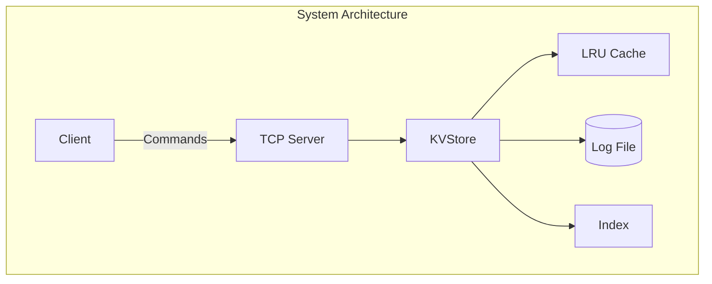
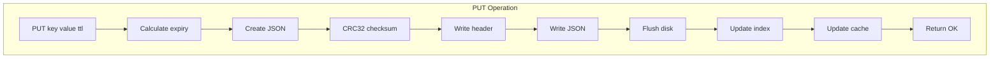
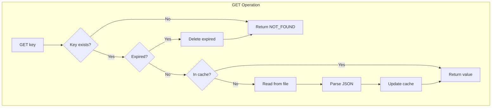
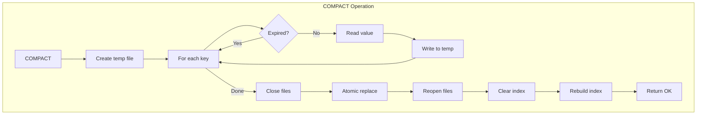
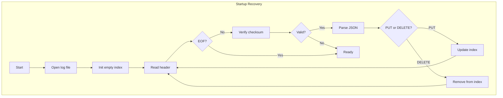

# 🗄️ BitPyStore

<div align="center">


**A lightweight, persistent key-value store with LRU caching and log-structured storage**

[Features](#-features) • [Quick Start](#-quick-start) • [Architecture](#-architecture) • [Documentation](#-documentation) • [Examples](#-examples)

</div>

---

## 📋 Table of Contents

- [Overview](#-overview)
- [Features](#-features)
- [Architecture](#-architecture)
- [Installation](#-installation)
- [Quick Start](#-quick-start)
- [API Reference](#-api-reference)
- [Flowcharts](#-flowcharts)
- [Performance](#-performance)
- [Use Cases](#-use-cases)
- [Limitations](#-limitations)
- [Contributing](#-contributing)
- [License](#-license)

---

## 🌟 Overview

**BitPyStore** is a Python-based key-value database that implements log-structured storage with crash recovery, TTL support, and LRU caching. Inspired by Bitcask, it provides a simple yet powerful storage engine perfect for learning database internals or embedding in small applications.

### Why BitPyStore?

- ✅ **Zero Dependencies** - Pure Python, no external libraries
- ✅ **Crash Recovery** - Automatic index rebuilding from append-only log
- ✅ **Fast Reads** - LRU cache with O(1) lookups
- ✅ **TTL Support** - Automatic key expiration
- ✅ **Data Integrity** - CRC32 checksums for corruption detection
- ✅ **Network Ready** - Built-in TCP server
- ✅ **Educational** - Clean, readable code demonstrating core DB concepts

---

## ✨ Features

| Feature | Description |
|---------|-------------|
| **Persistent Storage** | Append-only log file ensures durability |
| **In-Memory Index** | Hash table for O(1) key lookups |
| **LRU Cache** | Configurable cache (default: 1000 items) |
| **TTL Expiration** | Time-based automatic key deletion |
| **Log Compaction** | Garbage collection for deleted/old records |
| **Checksum Verification** | CRC32 integrity checks |
| **TCP Server** | Network access via simple protocol |
| **Context Manager** | Automatic resource cleanup |

---

## 🏗️ Architecture

```
┌─────────────────────────────────────────────────┐
│                  Client Layer                    │
│              (examples/client.py)                │
└───────────────────┬─────────────────────────────┘
                    │ TCP Socket
┌───────────────────▼─────────────────────────────┐
│               Network Layer                      │
│              (tcp_server.py)                     │
│    Protocol: PUT, GET, DEL, TTL, STATS, etc.    │
└───────────────────┬─────────────────────────────┘
                    │
┌───────────────────▼─────────────────────────────┐
│               Storage Engine                     │
│               (engine.py)                        │
│  ┌─────────────┐  ┌──────────────┐             │
│  │   Index     │  │  LRU Cache   │             │
│  │ key→offset  │  │   1000 items │             │
│  └─────────────┘  └──────────────┘             │
└───────────────────┬─────────────────────────────┘
                    │
┌───────────────────▼─────────────────────────────┐
│            Persistent Storage                    │
│        bitpystore.db (Log File)                 │
│  Format: [length checksum]\n[JSON]\n            │
└─────────────────────────────────────────────────┘
```

### Data Flow

**Write Path (PUT)**
```
Client → TCP Server → KVStore.put() → Write Log → Update Index → Update Cache → Response
```

**Read Path (GET)**
```
Client → TCP Server → KVStore.get() → Check Index → Check TTL → Check Cache → Read File → Response
```

---

## 📦 Installation

### Prerequisites
- Python 3.6 or higher
- No external dependencies required!

### Clone the Repository
```bash
git clone https://github.com/yourusername/bitpystore.git
cd bitpystore
```

### Create Data Directory
```bash
mkdir -p data
```

---

## 🚀 Quick Start

### Option 1: TCP Server Mode

**Start the Server**
```bash
python tcp_server.py
```

**Connect with Client**
```bash
python examples/client.py
```

**Example Session**
```
Server: Welcome to KVStore Server
> PUT name suraj
Server: OK
> GET name
Server: VALUE suraj
> TTL name 60
Server: OK
> STATS
Server: keys_in_index: 1
        keys_in_cache: 1
        put_count: 2
        ...
> DEL name
Server: DELETED
> EXIT
Server: OK
```

### Option 2: Embedded Mode

```python
from engine import KVStore

# Use context manager for automatic cleanup
with KVStore("data/mydb.db") as db:
    # Store a key-value pair
    db.put("user:1", "Alice")
    
    # Store with TTL (expires in 1 hour)
    db.put("session:abc", "token123", ttl=3600)
    
    # Retrieve value
    user = db.get("user:1")
    print(user)  # Output: Alice
    
    # Delete a key
    db.delete("user:1")
    
    # Compact the log
    db.compact()
    
    # Get statistics
    stats = db.stats()
    print(stats)
```

---

## 📚 API Reference

### KVStore Class

#### `__init__(filename="data/bitpystore.db")`
Initialize the database.

**Parameters:**
- `filename` (str): Path to the log file

**Example:**
```python
db = KVStore("data/mydb.db")
```

---

#### `put(key, value, ttl=None)`
Store a key-value pair.

**Parameters:**
- `key` (str): The key
- `value` (any): The value (JSON serializable)
- `ttl` (int, optional): Time-to-live in seconds

**Example:**
```python
db.put("config:timeout", 30)
db.put("session:xyz", {"user_id": 42}, ttl=1800)
```

---

#### `get(key)`
Retrieve a value by key.

**Parameters:**
- `key` (str): The key to retrieve

**Returns:**
- The stored value, or `None` if not found/expired

**Example:**
```python
value = db.get("config:timeout")
if value is None:
    print("Key not found or expired")
```

---

#### `delete(key)`
Delete a key.

**Parameters:**
- `key` (str): The key to delete

**Example:**
```python
db.delete("session:xyz")
```

---

#### `compact()`
Compact the log file to remove old/deleted records.

**Example:**
```python
db.compact()
```

---

#### `stats()`
Get database statistics.

**Returns:**
- Dictionary with metrics

**Example:**
```python
stats = db.stats()
print(f"Keys: {stats['keys_in_index']}")
print(f"File size: {stats['file_size_bytes']} bytes")
```

---

### TCP Protocol Commands

| Command | Syntax | Description | Response |
|---------|--------|-------------|----------|
| **PUT** | `PUT key value` | Store key-value | `OK` |
| **GET** | `GET key` | Retrieve value | `VALUE data` or `NOT_FOUND` |
| **DEL** | `DEL key` | Delete key | `DELETED` |
| **TTL** | `TTL key seconds` | Set TTL on existing key | `OK` or `NOT_FOUND` |
| **STATS** | `STATS` | Get statistics | Multi-line stats |
| **COMPACT** | `COMPACT` | Trigger compaction | `OK` |
| **SHUTDOWN** | `SHUTDOWN` | Stop server | `OK` |
| **EXIT** | `EXIT` | Disconnect client | `OK` |

---

## 📊 Flowcharts

### System Architecture


### PUT Operation Flow


### GET Operation Flow


### COMPACT Operation Flow


### Startup Recovery Flow


---

## ⚡ Performance

| Operation | Time Complexity | I/O Operations |
|-----------|----------------|----------------|
| PUT | O(1) | 1 sequential write |
| GET (cache hit) | O(1) | 0 |
| GET (cache miss) | O(1) | 1 random read |
| DELETE | O(1) | 1 sequential write |
| COMPACT | O(N) | Read all + Write all |

### Storage Format

**Log Record Structure:**
```
[length checksum]\n
[{"op": "put", "key": "name", "value": "suraj", "expiry": 0}]\n
```

**Index Structure:**
```python
{
    "name": (125, 0),        # (offset, expiry_timestamp)
    "age": (250, 1700000000) # expiry != 0 means TTL set
}
```

---

## 💡 Use Cases

### 1. Session Storage
```python
# Store user sessions with automatic expiration
db.put(f"session:{session_id}", session_data, ttl=1800)  # 30 minutes
```

### 2. Configuration Management
```python
# Persistent app configuration
db.put("config:db_host", "localhost")
db.put("config:db_port", "5432")
```

### 3. Caching Layer
```python
# Cache API responses
db.put(f"cache:api:{url}", response_json, ttl=300)  # 5 minutes
```

### 4. Feature Flags
```python
# Toggle features dynamically
db.put("feature:new_ui", "enabled")
if db.get("feature:new_ui") == "enabled":
    show_new_ui()
```

### 5. Job Queue
```python
# Simple persistent queue
db.put(f"job:{job_id}", job_data)
# Worker processes and deletes
process_job(db.get(f"job:{job_id}"))
db.delete(f"job:{job_id}")
```

---

## ⚠️ Limitations

- **Single-threaded** - No concurrent write support
- **Index in memory** - All keys must fit in RAM
- **No transactions** - Single-key operations only
- **Blocking compaction** - Compaction stops all operations
- **No replication** - Single-node only

### Not Suitable For:
- High-concurrency write workloads
- Large datasets (> millions of keys)
- Production systems requiring HA
- Applications needing ACID transactions

---

## 🔮 Future Roadmap

### v1.1
- [ ] Thread-safe operations with locks
- [ ] Background compaction
- [ ] Automatic compaction triggers

### v1.2
- [ ] Bloom filters for negative lookups
- [ ] Batch operations
- [ ] Key iteration support

### v2.0
- [ ] Log segmentation
- [ ] Compression support
- [ ] Master-slave replication

---

## 🤝 Contributing

Contributions are welcome! Please follow these steps:

1. Fork the repository
2. Create a feature branch (`git checkout -b feature/amazing-feature`)
3. Commit your changes (`git commit -m 'Add amazing feature'`)
4. Push to the branch (`git push origin feature/amazing-feature`)
5. Open a Pull Request

### Development Setup
```bash
git clone https://github.com/yourusername/bitpystore.git
cd bitpystore
python test/test_engine.py
```

---

## 📄 License

This project is licensed under the MIT License - see the [LICENSE](LICENSE) file for details.

---

## 🙏 Acknowledgments

- Inspired by [Bitcask](https://riak.com/assets/bitcask-intro.pdf) (Riak's storage engine)
- Influenced by [LevelDB](https://github.com/google/leveldb) design patterns
- Educational resource from [Designing Data-Intensive Applications](https://dataintensive.net/)

---

## 📞 Contact

**Suraj Akhuli** - [@SurajAkhuli](https://github.com/SurajAkhuli)

Project Link: [https://github.com/SurajAkhuli/BitPyStore](https://github.com/SurajAkhuli/BitPyStore)

---

<div align="center">

**⭐ Star this repository if you find it helpful!**

Made with ❤️ by Suraj Akhuli

</div>
