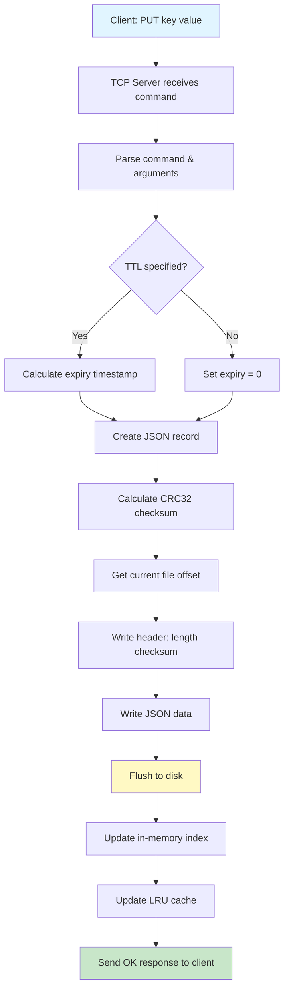
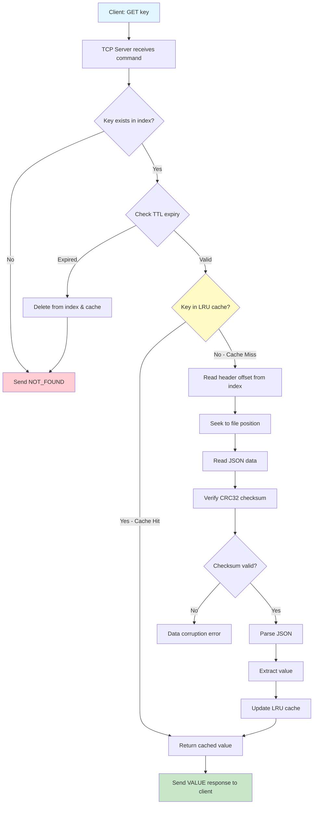
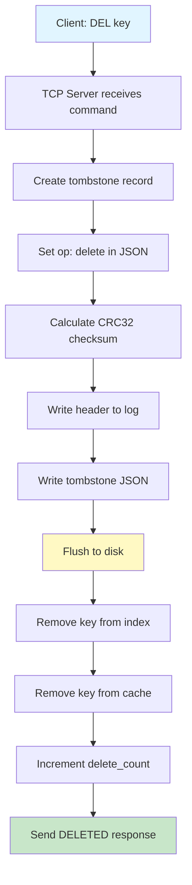
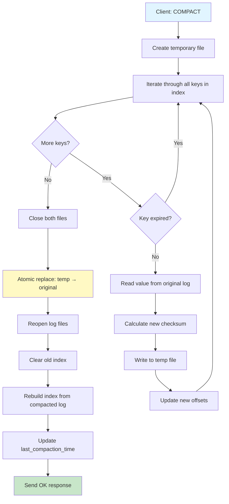
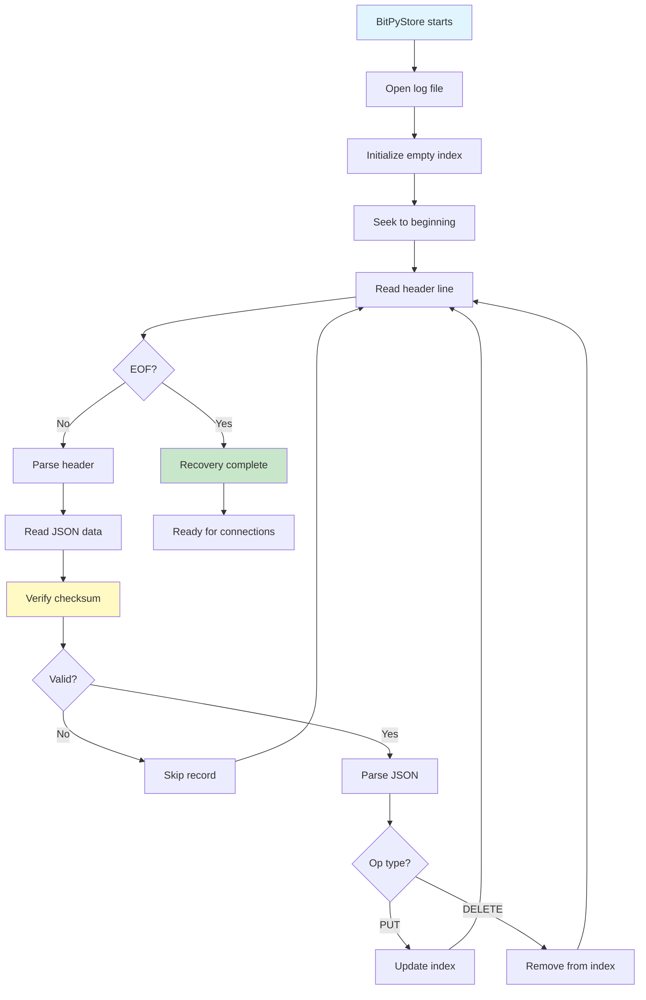

# 🗄️ BitPyStore

<div align="center">


**A lightweight, persistent key-value store with LRU caching and log-structured storage**

*Inspired by Bitcask • Built with Pure Python • Zero Dependencies*

[Features](#-features) • [Installation](#-installation) • [Quick Start](#-quick-start) • [Documentation](#-documentation) • [Architecture](#%EF%B8%8F-architecture)

</div>

---

## 📖 Overview

**BitPyStore** is a Python-based key-value database implementing log-structured storage with crash recovery, TTL support, and LRU caching. Inspired by Riak's Bitcask storage engine, it provides a simple yet powerful storage solution perfect for learning database internals or embedding in small applications.

### ✨ Why BitPyStore?

- ✅ **Zero Dependencies** - Pure Python implementation, no external libraries required
- ✅ **Crash Recovery** - Automatic index rebuilding from append-only log
- ✅ **Fast Reads** - LRU cache with O(1) lookups for frequently accessed keys
- ✅ **TTL Support** - Automatic key expiration with time-to-live
- ✅ **Data Integrity** - CRC32 checksums prevent data corruption
- ✅ **Network Ready** - Built-in TCP server for remote access
- ✅ **Educational** - Clean, readable code demonstrating core database concepts

---

## 🎯 Key Features

| Feature | Description |
|---------|-------------|
| **Persistent Storage** | Append-only log file ensures data durability across restarts |
| **In-Memory Index** | Hash table for O(1) key lookups without scanning files |
| **LRU Cache** | Configurable cache (default: 1000 items) for hot data |
| **TTL Expiration** | Time-based automatic key deletion |
| **Log Compaction** | Garbage collection to reclaim space from deleted/old records |
| **Checksum Verification** | CRC32 integrity checks on every read |
| **TCP Server** | Network access via simple text-based protocol |
| **Context Manager** | Automatic resource cleanup with `with` statement |
| **Crash Recovery** | Rebuilds index by replaying log file on startup |

---

## 🛠️ Tech Stack

- **Language**: Python 3.6+
- **Storage**: Log-structured file storage (Bitcask-inspired)
- **Caching**: Custom LRU implementation using OrderedDict
- **Networking**: TCP socket server (stdlib)
- **Serialization**: JSON for data records
- **Integrity**: CRC32 checksums (zlib)
- **Dependencies**: None (pure Python stdlib)

---

## 📦 Installation

### Prerequisites

- Python 3.6 or higher
- No external dependencies required!

### Clone the Repository

```bash
git clone https://github.com/SurajAkhuli/BitPyStore.git
cd BitPyStore
```

### Create Data Directory

```bash
mkdir -p data
```

That's it! No pip install needed. 🎉

---

## 🚀 Quick Start

### Option 1: TCP Server Mode

**1. Start the Server**

```bash
python tcp_server.py
```

You should see:
```
Server running on 127.0.0.1:5000
```

**2. Connect with Client**

Open a new terminal:

```bash
python examples/client.py
```

**3. Example Session**

```
Server: Welcome to KVStore Server
> PUT name suraj
Server: OK

> GET name
Server: VALUE suraj

> PUT session:abc token123 TTL 60
Server: OK

> TTL name 3600
Server: OK

> STATS
Server: keys_in_index: 2
        keys_in_cache: 2
        put_count: 3
        delete_count: 0
        file_size_bytes: 512
        last_compaction_time: None

> DEL name
Server: DELETED

> COMPACT
Server: OK

> EXIT
Server: OK
```

---

### Option 2: Embedded Mode

```python
from engine import KVStore

# Use context manager for automatic cleanup
with KVStore("data/mydb.db") as db:
    # Store a key-value pair
    db.put("user:1", "Alice")
    
    # Store with TTL (expires in 1 hour)
    db.put("session:abc", "token123", ttl=3600)
    
    # Retrieve value
    user = db.get("user:1")
    print(user)  # Output: Alice
    
    # Check if key exists
    session = db.get("session:abc")
    if session:
        print(f"Active session: {session}")
    
    # Delete a key
    db.delete("user:1")
    
    # Compact the log to reclaim space
    db.compact()
    
    # Get database statistics
    stats = db.stats()
    print(f"Total keys: {stats['keys_in_index']}")
    print(f"Cache size: {stats['keys_in_cache']}")
```

---

## 🗂️ Project Structure

```
BitPyStore/
├── README.md              # Project documentation
├── engine.py              # Core KVStore implementation
├── lru_cache.py           # LRU cache implementation
├── tcp_server.py          # TCP server for network access
├── examples/
│   └── client.py          # Example TCP client
├── test/
│   └── test_engine.py     # Unit tests and examples
└── data/                  # Data directory (created at runtime)
    └── *.log              # Log files
```

---

## 🏗️ Architecture

### System Overview

```
┌─────────────────────────────────────────────────┐
│                  Client Layer                    │
│              (examples/client.py)                │
└──────────────────┬──────────────────────────────┘
                   │ TCP Socket
┌──────────────────▼──────────────────────────────┐
│               Network Layer                      │
│              (tcp_server.py)                     │
│    Protocol: PUT, GET, DEL, TTL, STATS, etc.    │
└──────────────────┬──────────────────────────────┘
                   │
┌──────────────────▼──────────────────────────────┐
│               Storage Engine                     │
│               (engine.py)                        │
│  ┌─────────────┐  ┌──────────────┐             │
│  │   Index     │  │  LRU Cache   │             │
│  │ key→offset  │  │   1000 items │             │
│  └─────────────┘  └──────────────┘             │
└──────────────────┬──────────────────────────────┘
                   │
┌──────────────────▼──────────────────────────────┐
│            Persistent Storage                    │
│        bitpystore.db (Log File)                 │
│  Format: [length checksum]\n[JSON]\n            │
└─────────────────────────────────────────────────┘
```

---

## 📊 Data Flow Diagrams

### PUT Operation Flow



### GET Operation Flow



### DELETE Operation Flow



### COMPACT Operation Flow



### Crash Recovery Flow (Startup)



---

---

## 📚 API Reference

### KVStore Class

#### Constructor

```python
KVStore(filename="data/bitpystore.db")
```

**Parameters:**
- `filename` (str): Path to the log file

**Example:**
```python
db = KVStore("data/mydb.db")
```

---

#### `put(key, value, ttl=None)`

Store a key-value pair with optional TTL.

**Parameters:**
- `key` (str): The key to store
- `value` (any): The value (must be JSON serializable)
- `ttl` (int, optional): Time-to-live in seconds

**Example:**
```python
db.put("config:timeout", 30)
db.put("session:xyz", {"user_id": 42}, ttl=1800)  # Expires in 30 minutes
```

---

#### `get(key)`

Retrieve a value by key.

**Parameters:**
- `key` (str): The key to retrieve

**Returns:**
- The stored value, or `None` if not found/expired

**Example:**
```python
value = db.get("config:timeout")
if value is None:
    print("Key not found or expired")
else:
    print(f"Value: {value}")
```

---

#### `delete(key)`

Delete a key from the store.

**Parameters:**
- `key` (str): The key to delete

**Example:**
```python
db.delete("session:xyz")
```

---

#### `compact()`

Compact the log file to remove deleted and expired records.

**Example:**
```python
db.compact()  # Reclaim disk space
```

---

#### `stats()`

Get database statistics.

**Returns:**
- Dictionary with the following metrics:
  - `keys_in_index`: Number of keys in the index
  - `keys_in_cache`: Number of keys cached
  - `put_count`: Total PUT operations
  - `delete_count`: Total DELETE operations
  - `file_size_bytes`: Log file size
  - `last_compaction_time`: Timestamp of last compaction

**Example:**
```python
stats = db.stats()
print(f"Keys: {stats['keys_in_index']}")
print(f"File size: {stats['file_size_bytes']} bytes")
```

---

### TCP Protocol Commands

| Command | Syntax | Description | Response |
|---------|--------|-------------|----------|
| **PUT** | `PUT key value [TTL seconds]` | Store key-value pair | `OK` |
| **GET** | `GET key` | Retrieve value | `VALUE data` or `NOT_FOUND` |
| **DEL** | `DEL key` | Delete key | `DELETED` |
| **TTL** | `TTL key seconds` | Update TTL on existing key | `OK` or `NOT_FOUND` |
| **STATS** | `STATS` | Get database statistics | Multi-line stats output |
| **COMPACT** | `COMPACT` | Trigger log compaction | `OK` |
| **SHUTDOWN** | `SHUTDOWN` | Stop the server | `OK` |
| **EXIT** | `EXIT` | Disconnect client | `OK` |

---

## ⚡ Performance

| Operation | Time Complexity | I/O Operations | Notes |
|-----------|----------------|----------------|-------|
| PUT | O(1) | 1 sequential write | Append to log file |
| GET (cache hit) | O(1) | 0 | Pure memory lookup |
| GET (cache miss) | O(1) | 1 random read | Index provides offset |
| DELETE | O(1) | 1 sequential write | Tombstone marker |
| COMPACT | O(N) | Read all + Write all | Blocks other operations |

### Storage Format

**Log Record Structure:**
```
[length checksum]\n
[{"op": "put", "key": "name", "value": "suraj", "expiry": 0}]\n
```

**Index Structure (In-Memory):**
```python
{
    "name": (125, 175, 0),              # (header_offset, json_offset, expiry)
    "session:abc": (250, 300, 1700000000)  # expiry timestamp for TTL
}
```

---

## 💡 Use Cases

### 1. Session Storage
```python
# Store user sessions with automatic expiration
db.put(f"session:{session_id}", session_data, ttl=1800)  # 30 minutes
```

### 2. Configuration Management
```python
# Persistent application configuration
db.put("config:db_host", "localhost")
db.put("config:db_port", "5432")
db.put("config:max_connections", "100")
```

### 3. Caching Layer
```python
# Cache expensive API responses
api_key = f"cache:api:{url}"
cached = db.get(api_key)
if not cached:
    cached = expensive_api_call(url)
    db.put(api_key, cached, ttl=300)  # 5 minutes
```

### 4. Feature Flags
```python
# Toggle features dynamically without deployment
db.put("feature:new_ui", "enabled")
db.put("feature:beta_access", "disabled")

if db.get("feature:new_ui") == "enabled":
    show_new_ui()
```

### 5. Job Queue
```python
# Simple persistent job queue
db.put(f"job:{job_id}", job_data)

# Worker processes jobs
job = db.get(f"job:{job_id}")
if job:
    process_job(job)
    db.delete(f"job:{job_id}")
```

---

## ⚠️ Limitations

### Current Constraints

- **Single-threaded** - No concurrent write support (use locks for multi-threading)
- **Index in memory** - All keys must fit in RAM
- **No transactions** - Single-key operations only, no ACID guarantees
- **Blocking compaction** - Compaction stops all operations temporarily
- **No replication** - Single-node only, no high availability

### Not Suitable For:

❌ High-concurrency write workloads  
❌ Large datasets (> millions of keys with limited RAM)  
❌ Production systems requiring high availability  
❌ Applications needing multi-key ACID transactions  
❌ Distributed or replicated storage requirements  

### Better Alternatives For Production:

- **Redis** - For in-memory caching with persistence
- **RocksDB** - For embedded LSM-tree storage
- **PostgreSQL** - For transactional relational data
- **MongoDB** - For document-oriented data

---

## 🧪 Testing

Run the test suite:

```bash
python test/test_engine.py
```

### Test Scenarios Included:

- ✅ Basic PUT/GET/DELETE operations
- ✅ Index persistence across restarts
- ✅ TTL expiration behavior
- ✅ Log compaction correctness
- ✅ Cache hit/miss scenarios
- ✅ Crash recovery simulation

---

## 🔮 Future Roadmap

### v1.1 - Concurrency & Performance
- [ ] Thread-safe operations with read-write locks
- [ ] Background compaction (non-blocking)
- [ ] Automatic compaction triggers based on log size
- [ ] Batch PUT/DELETE operations

### v1.2 - Advanced Features
- [ ] Bloom filters for negative lookups
- [ ] Key iteration support with cursors
- [ ] Range queries (prefix matching)
- [ ] Snapshot isolation for consistent reads

### v2.0 - Scalability
- [ ] Log segmentation for better concurrency
- [ ] Compression support (snappy/zstd)
- [ ] Master-slave replication
- [ ] Distributed consensus (Raft)

---

## 🤝 Contributing

Contributions are welcome! Here's how you can help:

1. **Fork** the repository
2. **Create** a feature branch (`git checkout -b feature/amazing-feature`)
3. **Commit** your changes (`git commit -m 'Add amazing feature'`)
4. **Push** to the branch (`git push origin feature/amazing-feature`)
5. **Open** a Pull Request

### Development Setup

```bash
git clone https://github.com/SurajAkhuli/BitPyStore.git
cd BitPyStore
python test/test_engine.py
```

### Code Style

- Follow PEP 8 guidelines
- Add docstrings to new functions
- Include tests for new features
- Update README for API changes

---

## 📄 License

This project is licensed under the **MIT License** - see the [LICENSE](LICENSE) file for details.

```
MIT License - Copyright (c) 2024 Suraj Akhuli
```

---

## 🙏 Acknowledgments

- **Inspired by**: [Bitcask](https://riak.com/assets/bitcask-intro.pdf) - Riak's storage engine design
- **Influenced by**: [LevelDB](https://github.com/google/leveldb) - Log-structured merge-tree patterns
- **Educational Resource**: [Designing Data-Intensive Applications](https://dataintensive.net/) by Martin Kleppmann

---

## 📞 Contact & Support

**Suraj Akhuli**  
- GitHub: [@SurajAkhuli](https://github.com/SurajAkhuli)
- Project: [BitPyStore](https://github.com/SurajAkhuli/BitPyStore)

### Found a bug or have a feature request?
- Open an [issue](https://github.com/SurajAkhuli/BitPyStore/issues)
- Start a [discussion](https://github.com/SurajAkhuli/BitPyStore/discussions)

---

## 📊 Project Stats


---

<div align="center">

**⭐ Star this repository if you find it helpful!**

Made with ❤️ by [Suraj Akhuli](https://github.com/SurajAkhuli)

*Learning database internals, one commit at a time* 🚀

</div>
